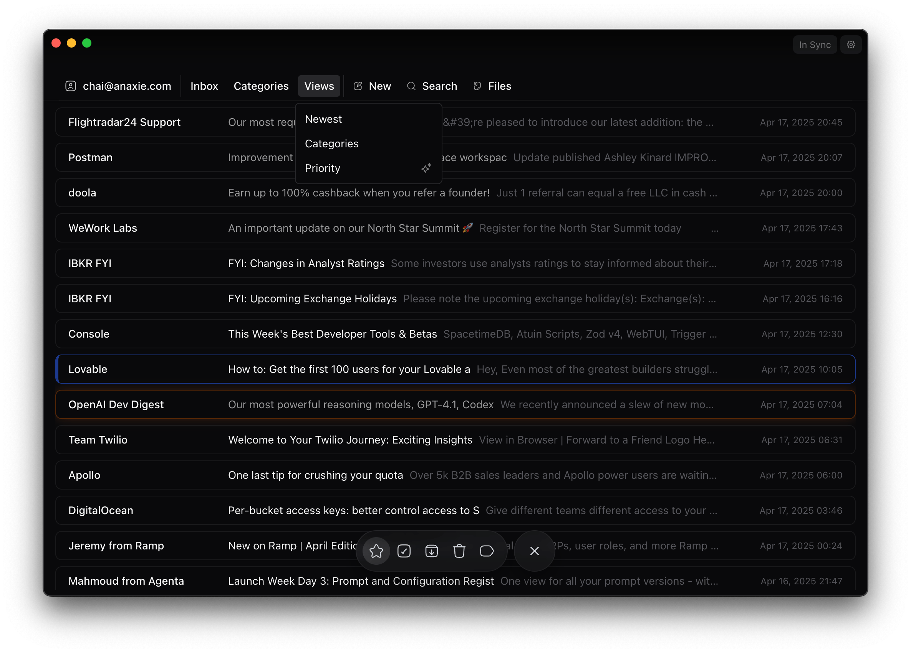

<div align="center">
  

# Mox

A lightning-fast, AI-powered email client for the modern workspace

[](https://opensource.org/licenses/MIT)
[](https://www.electronjs.org/)
[](https://reactjs.org/)
[](https://www.typescriptlang.org/)
[](https://tailwindcss.com/)



</div>

---

## ✨ Features (ALPHA)

- **AI-Powered Workflows**: Intelligent email sorting, summarization, and response suggestions
- **Lightning Fast**: Built on Electron for native-like performance across platforms
- **Beautiful UI**: Clean, intuitive interface with customizable themes
- **Privacy Focused**: Your data stays on your device with local processing options
- **Open Source**: Community-driven development, free forever

## 🚀 Getting Started

### Prerequisites

- [Node.js](https://nodejs.org/en/) (version 18 or above)
- [npm](https://www.npmjs.com/)

### Installation

```bash
# Clone the repository
git clone https://github.com/yourusername/mox.git
cd mox

# Install dependencies
npm install
```

### Development

```bash
# Start the development server
npm run dev
```

### Building for Production

```bash
# For Windows
npm run build:win

# For macOS
npm run build:mac

# For Linux
npm run build:linux
```

## 🧩 Architecture

Mox is built with modern technologies:

- **Electron**: Cross-platform desktop runtime
- **React**: UI framework with functional components
- **TypeScript**: Type-safe JavaScript
- **TailwindCSS**: Utility-first CSS framework
- **MobX**: State management
- **Drizzle ORM**: Database interactions
- **AI SDK**: Integration with various AI providers

## 🤝 Contributing

We welcome contributions of all kinds! See our [contributing guide](CONTRIBUTING.md) to get started.

1. Fork the repository
2. Create your feature branch (`git checkout -b feature/amazing-feature`)
3. Commit your changes (`git commit -m 'Add some amazing feature'`)
4. Push to the branch (`git push origin feature/amazing-feature`)
5. Open a Pull Request

## 📝 License

Distributed under the MIT License. See `LICENSE` for more information.

## 🙏 Acknowledgments

- [Electron](https://www.electronjs.org/)
- [React](https://reactjs.org/)
- [TypeScript](https://www.typescriptlang.org/)
- [TailwindCSS](https://tailwindcss.com/)
